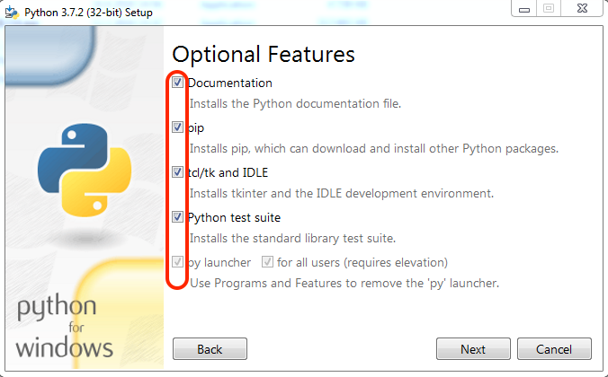

=========
Windows
=========

.. _sec:python-win:

Python
------

.. _sec-win:checking-if-python:

Checking if python exists
~~~~~~~~~~~~~~~~~~~~~~~~~

Before installing please check if you already have python installed on
your computer. To do so open Git Bash (If you haven't installed this application you can do so following the link `Git <https://git-scm.com/download/win>`__)

Once Git Bash is open execute the following commands,

.. code:: bash

   $ python -V

.. code:: bash

   $ python3 -V

If either of them returns ``Python 3`` then you can skip the Python
installation section and continue with the rest.

.. _sec-win:installation-python:

Installation
~~~~~~~~~~~~

To download and install Python use the link :
`Python-Windows <https://www.python.org/downloads/windows/>`__

During installation, when you see the pop up window figure
`1 <#fig:win-py-step1>`__ make sure you check on the box *Add Python 3.7
to PATH* and you click on the customize installation option.

Next, you will see figure `2 <#fig:win-py-step2>`__ where you need to
make sure all the check boxes are ticked. Finally in the advanced
options step like figure `3 <#fig:win-py-step3>`__ you need to tick the
choices like shown in the figure unless you are sure you know the
implications of your choices.

.. figure:: figures/python_install_1.png
   :alt: Python installation customization - Step 1
   :name: fig:win-py-step1

   Python installation customization - Step 1

   Python installation customization - Step 2

   Python installation customization - Step 3

*Install 3.7.2*

After installation to verify if everything is working open Git Bash
again and run the above commands to check the python versions.

.. _sec-win:pip:

Pip
---

Python has a huge repository of packages that are widely used for
different functions. In order to obtain these packages there are several
package managers. The one we will be using during this course will be
the official package installer for Python called :math:`pip`.

.. _sec-win:checking-if-pip:

Checking if pip exists
~~~~~~~~~~~~~~~~~~~~~~

If you installed Python based on the instructions above then pip should
be installed by default. Or it may have been already installed on your
computer if Python had been pre-installed. To check if pip exists, open
Git Bash and execute the following command:

:math:`pip` or :math:`pip3` depends on your system. Typically they
differentiate ones installed with python2 and python3 respectively.

.. code:: bash

   $ pip --version

.. code:: bash

   $ pip3 --version

If :math:`pip` is already installed then at least one of the above
commands should print the version of the pip along with the python and
its version associated with it. **Make sure that the python version is 3**

.. _sec-win:installation-pip:

Installation
~~~~~~~~~~~~

If you have verified that pip is not installed on your computer then in
order to install pip you are expected to have either cloned or
downloaded the exercise repository by now.

-  Open Git Bash

-  Navigate to the location where you have downloaded the exercise
   repository. You can use the command :math:`cd` to change directories
   and :math:`pwd` to check you current directory.

-  Inside the exercise repository navigate to **extras** folder and
   execute the following command:

.. code:: bash

   $ python get-pip.py

*Make sure command*\ **python**\ *refers to python-3. To check use the
commands mentioned in Python Installation section to get the
corresponding python version. Accordingly use either python or python3
commands*

Check if you have installed everything correctly by referring to
`2.2.1 <#sec-win:checking-if-pip>`__.

.. _sec-win:spyder:

Spyder
------

Python programs can be written and run in several ways, it can be simply
done on a terminal by running *python* or *ipython*. While this method
is limited for simple programs, larger programs will be written using a
text-editor or an Integrated Development Environment (IDE). Though it is
not necessary to have an IDE for programming in Python, having one will
bring many features that are useful while starting new

.. _sec-win:installation-spyder:

Installation
~~~~~~~~~~~~

-  Open Git Bash

-  Next, install spyder with the command:

   .. code:: bash

      $ pip install spyder

   or

   .. code:: bash

      $ pip3 install spyder

.. _sec-win:checking-if-spyder:

Checking spyder
~~~~~~~~~~~~~~~

To check if spyder is installed, execute the following command from Git
Bash

.. code:: bash

   $ spyder3

If everything is working then Spyder IDE should open and you are ready
to begin with the exercises.

Requirements
------------

The final step before starting of with the exercise is to install a few
necessary packages. We will be using pip to this.

-  Open terminal (Git Bash on Windows)

-  Navigate in the terminal to the exercise repository on your computer

-  Execute the following command once you are in the root of the
   repository:

   .. code:: bash

      $ pip install -r requirements.txt

   or

   .. code:: bash

      $ pip3 install -r requirements.txt

   Use :math:`pip` or :math:`pip3` depending on the one that refers to python3

The *requirements.txt* installs the following packages:

-  numpy : Scientific computing package for python

-  matplotlib : Matlab like plotting tool for python

-  farms_pylog : Module for logging messages during code runtime

After successfully completing the installation steps in the previous
sections, you can now get started with programming Lab0. Python
is not just a computational tool but a very powerful programming
language. This means having to learn a few more extra concepts to get
your job done. There are a ton of references available online for those
who are interested in learning Python in depth. We will try to provide
the necessary references to help with the concepts that are useful
during the course as and when needed.
