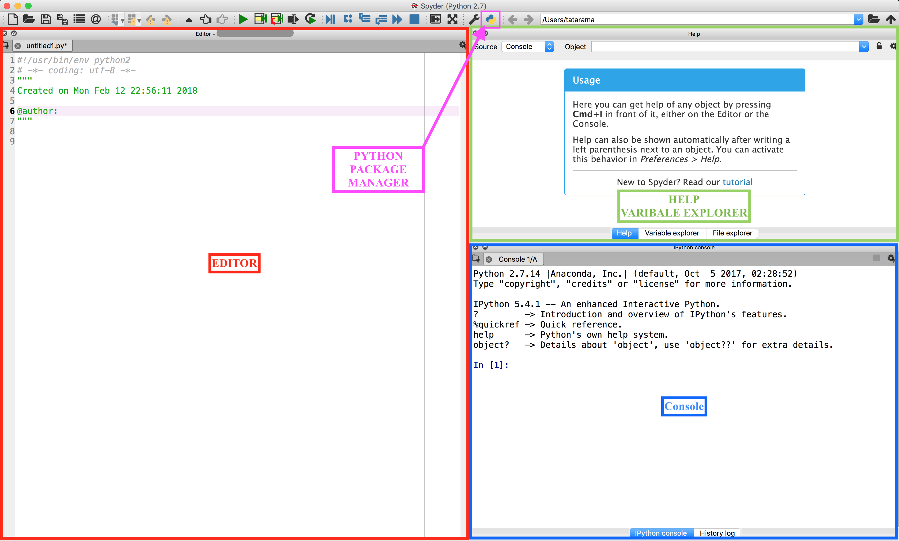

.. _sec:spyder:

Introduction to Spyder
======================

Spyder can be run by executing the command *spyder*.

Figure `6 <#fig:spyder>`__ shows the main windows when you first open
Spyder. As you may have noticed, the layout is similar to Matlab. Spyder
has very good documentation to get you started. It is recommended to go
through the steps to get familiarized with the IDE.

   Spyder IDE overview

The three essential parts of the screen are outlined.

-  **The console** (bottom right, marked in blue). You can work
   interactively here. Code run, either interactively or from the
   editor, will output any results here. Error messages will be reported
   here. There are two types of console: a Python console, and an
   IPython console. Both will run Python code, but we recommend the
   IPython console as it offers better visuals for debugging and has
   additional features.

-  **The editor** (left, marked in red). You can write code to be saved
   to file or run here. This will suggest problems with syntax and has
   features to help debug and give additional information.

-  **The inspector** (top right, marked in green). The Object inspector
   can display detailed help on specific objects (or functions, or...),
   and the Variable inspector can display detailed information on the
   variables that are currently defined. Extremely useful when
   debugging.

-  **Python Package Manager** (top toolbar, marked in pink) Use this
   menu to add new paths to the default python package paths. (NOTE :
   The symbol may look slightly different on your machine from the one
   shown in this report)

For an in depth tutorial of Spyder follow the
`link <http://www.southampton.ac.uk/~fangohr/blog/spyder-the-python-ide.html#first-steps-with-spyder>`__.

.. _sec:getting-help:

Getting Help
------------

In any python console you can get information about a particular python
object using the *help* method. For example to get help on the type
float,

.. code:: python

   help(float)

In spyder you can use this method in the console window. The Spyder
environment also provides a panel in the top right corner (by default)
which is the Object inspector. If you type float into the empty line in
the Object inspector window, it will also provide the help string.

.. _sec:debugging:

Debugging
---------

Refer to the link
`debug <http://www.southampton.ac.uk/~fangohr/blog/spyder-the-python-ide.html#line-by-line-step-execution-of-code>`__
